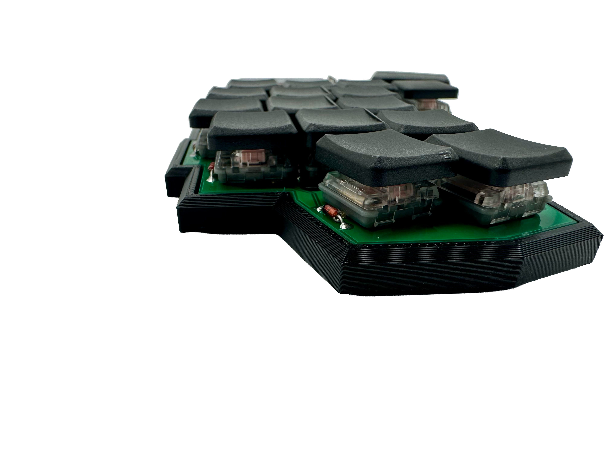

# Idle Builds — Dinkey Keyboard Series

Open source low-profile wireless split keyboards designed and built by [Idle Builds](https://idlebuilds.com).

---

## The Lineup

| Board | Keys | Status |
|---|---|---|
| **Dinkey 34** | 34 | Available |
| **Dinkey 32\|30** | 32 or 30 | Available |
| **Dinkey 36** | 36 | Coming soon |
| **Dinkey 42** | 42 | Coming soon |
| **Dinkey 52** | 52 | Coming soon |

The Dinkey 34 is the entry point — a comfortable, approachable 34-key split that shares its PCB footprint with the 32|30. The 32|30 is the refined endgame: same board, fewer keys, more intentional layout. Both run identical firmware logic, differing only in PCB design and pin assignments.

---

## Dinkey 34

| ZMK Build | QMK Build |
|:---:|:---:|
|  |  |

A 34-key column-staggered wireless split. 3 pinky column keys and 2 thumb keys per side. The gateway into the Dinkey lineup.

**[→ ZMK Config](https://github.com/IdleBuilds/zmk-config-dinkey_34)** | **[→ Buy](https://idlebuilds.com)**

---

## Dinkey 32|30

| 32-key config | 30-key config |
|:---:|:---:|
|  |  |

| No case | Side profile |
|:---:|:---:|
|  |  |

| Case | PCB (back) |
|:---:|:---:|
|  |  |

The endgame. Modular pinky column accommodates 1 or 2 switches without firmware changes — you choose your key count. Same PCB as the 34, tighter layout.

**[→ ZMK Config](https://github.com/IdleBuilds/zmk-config-dinkey_32_30)** | **[→ Buy](https://idlebuilds.com)**

---

## Firmware

Both the Dinkey 34 and 32|30 support three firmware options:

### ZMK — Wireless (recommended)

ZMK runs on the Nice!Nano v2 and supports Bluetooth 5.0, ZMK Studio for real-time keymap editing, and deep sleep for long battery life.

| Board | Config Repo |
|---|---|
| Dinkey 34 | [zmk-config-dinkey_34](https://github.com/IdleBuilds/zmk-config-dinkey_34) |
| Dinkey 32\|30 | [zmk-config-dinkey_32_30](https://github.com/IdleBuilds/zmk-config-dinkey_32_30) |

Fork the relevant repo, customize your keymap, and GitHub Actions builds your firmware automatically.

### QMK — Wired

QMK runs on the Pro Micro and supports USB-C wired operation. See the [QMK README](qmk/README.md) for compile and flash instructions.

### Vial — Wired with GUI remapping

Vial is a QMK fork that adds a real-time GUI keymap editor over USB. See the [Vial README](vial-qmk/README.md) for setup instructions.

---

## Build Guide

Full step-by-step assembly instructions including soldering, flashing, and troubleshooting are at [idlebuilds.com/build-guide](https://idlebuilds.com/build-guide).

---

## Hardware

| Folder | Contents |
|---|---|
| `kicad/` | PCB design files (KiCad) |
| `qmk/` | QMK firmware + README |
| `vial-qmk/` | Vial firmware + README |
| `zmk/` | ZMK config files (legacy, see standalone repos above) |
| `docs/` | Images, schematics, reference files |

---

## Specs

| | Dinkey 34 | Dinkey 32\|30 |
|---|---|---|
| **Keys** | 34 | 32 or 30 |
| **Switches** | Kailh Choc V1 | Kailh Choc V1 |
| **Controller** | Nice!Nano v2 / Pro Micro | Nice!Nano v2 / Pro Micro |
| **Display** | Nice!View / 128×32 OLED | Nice!View / 128×32 OLED |
| **Connectivity** | BT 5.0 / USB-C | BT 5.0 / USB-C |
| **Battery** | 110mAh LiPo | 110mAh LiPo |
| **Case** | 3D printed TPU | 3D printed TPU |
| **PCB** | JLCPCB | JLCPCB |

---

## Purchasing

Kits and complete builds available at [idlebuilds.com](https://idlebuilds.com).

| Option | Price |
|---|---|
| Kit — Wired | from $80 |
| Kit — Wireless | from $195 |
| Complete Build — Wired | from $175 |
| Complete Build — Wireless | from $275 |

---

## Contact

Questions, build help, or custom orders — reach out at [eldi@idlebuilds.com](mailto:eldi@idlebuilds.com)

---

## License

Hardware and firmware are open source. See individual folders for license details.

MIT © Idle Builds
